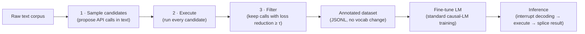

# toolformer-agent

A runnable Python implementation of **Toolformer** — *"Language Models Can Teach Themselves to Use Tools"* (Schick et al., 2023, [arXiv:2302.04761](https://arxiv.org/abs/2302.04761)).

Toolformer's big idea: instead of hand-labeling when a model should call an API, let the model **annotate its own training text with candidate API calls, execute them, and keep only the calls that measurably reduce its loss** on the tokens that follow. The surviving annotations become self-supervised training data, and the fine-tuned model then decides at inference time — mid-generation — when to call a tool, what to pass it, and how to fold the result back in.

This repo implements that full loop, running **100% offline** with a deterministic mock LM (a real OpenAI-compatible backend is optional).

## Quickstart

```bash
pip install -r requirements.txt
python examples/run_demo.py   # no API key, no network
pytest -q                     # 19 tests
```

## How it works



**Example — training-data loop:**

```
TEXT: The capital of Ohio is Columbus, a growing Midwestern city.
  [KEEP] [QA("capital of Ohio")] -> Columbus   (loss −0.48 nats)
  [drop] [Calculator("9*9")]     -> 81         (loss −0.00 nats)
```

**Example — inference with tool use (paper §4):**

```
PROMPT: What is 847 * 923?
OUTPUT: What is 847 * 923? [Calculator("847 * 923")] -> 781781 The answer is 781781.
```

## Paper → code mapping

| Paper section | Concept | Implementation |
|---|---|---|
| §3.1 Sampling | Few-shot prompt proposes API-call positions | `toolformer/annotator.py` → `sample_candidates()` (rule-based proposers standing in for the prompt; deliberately over-generates) |
| §3.1 API format | Calls encoded with plain tokens (`[`, `]`, `->`), no vocab change | `toolformer/tools.py` + `CALL_FMT` in `annotator.py` |
| §3.2 Executing | Run every candidate call | `toolformer/tools.py` → `ToolRegistry.call()` — Calculator, QA, Search, Translator, Calendar (the paper's five tool families) |
| §3.3 Filtering | Keep a call only if its response lowers loss on following tokens by ≥ threshold τ, vs. no-call *and* blind-call baselines | `toolformer/annotator.py` → `filter_candidates()`; loss via `LanguageModel.continuation_loss()` |
| §3.4 Fine-tuning | Train the LM on the annotated sequences | `toolformer/dataset.py` → `build_training_data()` exports the JSONL the paper fine-tunes on (real training = ordinary causal-LM training) |
| §4 Inference | Interrupt decoding at an API call, execute, splice in the response | `toolformer/inference.py` → `ToolformerDecoder` (with `trace()` for a step-by-step call log) |

## Using a real model

The mock LM (`toolformer/model.py` → `MockLM`) is a deterministic word-coverage model that reproduces the *shape* of the paper's filtering criterion without a GPU. To use a real model instead, point `OpenAILM` at any OpenAI-compatible endpoint:

```bash
export TOOLFORMER_BASE_URL="http://localhost:11434/v1"  # e.g. Ollama
export TOOLFORMER_API_KEY="ollama"
```

```python
from toolformer import OpenAILM, ToolformerDecoder, build_default_registry
decoder = ToolformerDecoder(OpenAILM("llama3.1"), build_default_registry())
print(decoder.complete("What is 847 * 923?"))
```

## Project layout

```
toolformer/
  tools.py       # the five tool families + registry
  model.py       # LanguageModel protocol, MockLM (offline), OpenAILM
  annotator.py   # sample → execute → filter
  inference.py   # decoding with API-call interruption
  dataset.py     # annotated JSONL export (paper §3.4)
examples/run_demo.py   # offline end-to-end demo
tests/                 # pytest suite
```

## Limitations

- Fine-tuning itself is not run here (it needs a base model + GPU); this repo produces exactly the annotated training data the paper trains on.
- The mock LM is a didactic stand-in, not a real likelihood model — swap in `OpenAILM` for genuine loss numbers.
- The paper's tools hit live APIs; these are faithful offline equivalents (safe-eval calculator, small KB, mock search index, phrasebook translator, real date logic).

## License

MIT — see [LICENSE](LICENSE).
